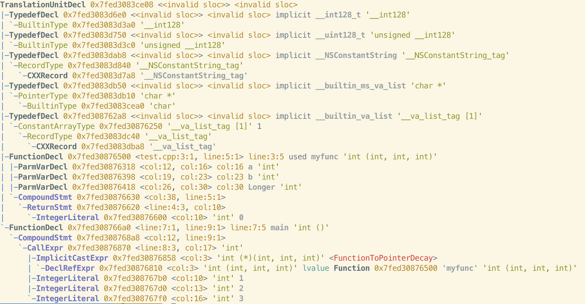
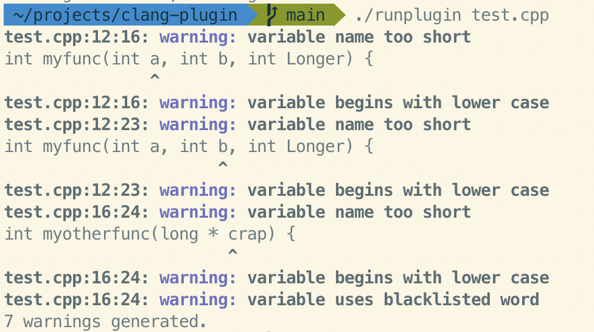

# clang-plugin
Demonstrating a plugin for clang on MacOS

The plugin traverses the AST for a source file to find all function
arguments/parameters. Then compliance with a 'code standard' is checked:

* Parameters must be at least 5 characters long
* Parameters must start with Uppercase
* Parameters must not be in list of 'forbidden words' (crap, gylle)

## Building clang
    > git clone [--depth=1] https://github.com/llvm/llvm-project.git
    > mkdir -p llvm-project/build
    > cd llvm-project/build
    > cmake -DLLVM_ENABLE_PROJECTS=clang -DCLANG_BUILD_EXAMPLES=ON -G "Unix Makefiles" ../llvm
    > make

Now go do something else for a while as the build takes a long time.

## Looking at AST for selected code

    > clang -fsyntax-only -Xclang -ast-dump test.cpp

## Write the plugin code
In this case see MyPlugin/MyPlugin.cpp

## Add the plugin
    > cp -r MyPlugin llvm-project/clang/examples
    > echo "add_subdirectory(MyPlugin)" >> llvm-project/clang/examples/CMakelists.txt
    > cd llvm-project/build
    > make MyPlugin

## Test the plugin
Use or modify the runplugin script

    > ./runplugin test.cpp

